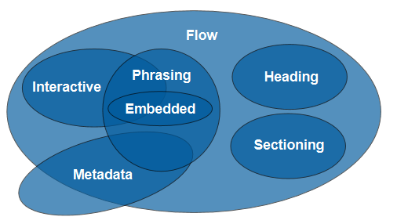
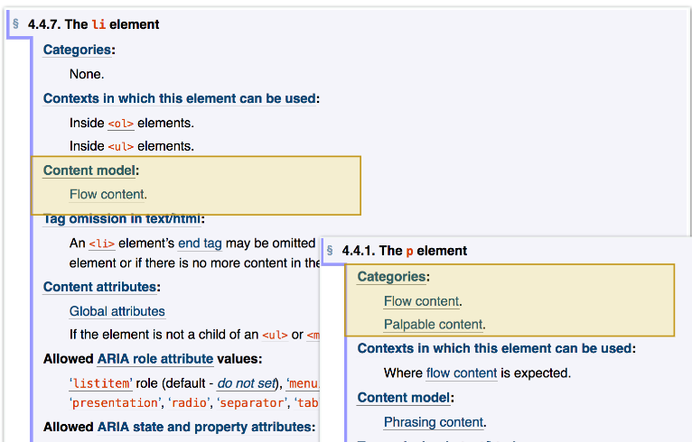
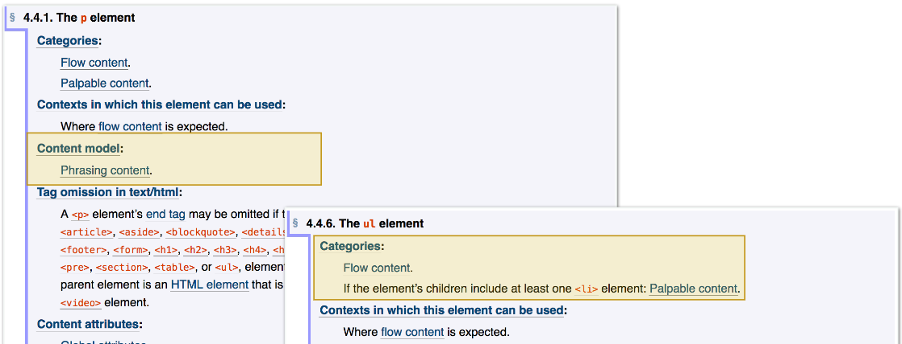

Topics covered in this blog post: Semantic, document flow, content-model
Requirements: Understanding what is HTML tags.

The first thing that will be cover what is tag description?
Tag description it is what tag can contain itself and which tags we can pass into this,
for example can we insert tag ul inside p? No! Why?

Each tag due the spec https://www.w3.org/TR/html/semantics.html#semantics
has content-model, categories, etc.

Content-model describe what we can pass into tag, categories describe where we can pass it.

There are many categories: Metadata content, Flow content, Sectioning, Heading, Phrasing, Embedded. Interactive.

1. Metadata content - metadata for browsers, search engines, etc. (everything in `<head>`). 
2. Flow content - streaming content (everything that is `<body>`).
3. Sectioning content - large semantic sections of the document. 
4. Heading content - headers. 
5. Phrasing content - phrasing content, the text of the document itself, small text elements that are smaller than paragraphs. 
6. Embedded content - embedded content (images, video content). , audio, see below) .
7. Interactive content - Interactive elements, what the user interacts with.

It is very simple algorithm,
If we wanna know what tag can be inserted inside another we need
1) Check the content-model tag in which we insert
2) Check the tag categories what you wanna insert
3) If the category is allowed then you can insert it

Few examples
tag `
` inside `<li>`.

`<li>` content model is flow content in other side `
` categories contain flow content it's mean you can easily insert `
` into `<li>`.

So why we can't insert `<ul>` inside `
`?

Because as you see `
` has a phrasing model, `<ul>` does not have categories as a phrasing, it's mean inserting it's not allowed.

It is first part of markup prologue see the second [markup-prologue-part-2](https://divji.ml/markup-prologue-part-2).

Thanks for watching!